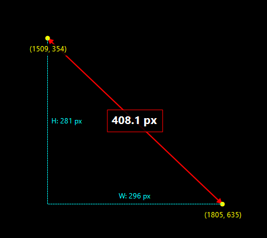

# Measuring Stick

A lightweight Windows system tray application for measuring pixel distances on screen.



## Features

- **Click and drag** anywhere on screen to measure distances
- **Displays**: Total distance, width, height, and screen coordinates
- **Measure + Screenshot**: Measure, then select a region to capture with the measurement overlay
- **Region Screenshot**: Quickly capture any area of your screen
- **Settings**: Configurable save location, opacity, clipboard options
- **Auto-start with Windows** option
- **Multi-monitor support**

## Download

Go to [Releases](https://github.com/CurioCrafter/MeasuringStick/releases) and download:

| File | Description |
|------|-------------|
| `MeasuringStick-Setup.exe` | **Installer** - Guided setup with Start Menu shortcuts, optional desktop icon, and uninstaller |
| `MeasuringStick.exe` | **Portable** - Single executable, no installation needed, run from anywhere |

### Which should I choose?

- **Use the Installer** if you want a traditional installation with Start Menu entries, easy uninstall via Windows Settings, and optional auto-start with Windows.
- **Use the Portable exe** if you want to run it from a USB drive, don't want to install anything, or just want to try it out quickly.

Both versions are identical in functionality.

## Usage

1. **Left-click** the tray icon to start measuring
2. **Click and drag** on screen to measure between two points
3. **Release** to see the final measurement
4. **Right-click** or press **ESC** to close the overlay

### Right-click Menu Options

- **Measure** - Basic measurement mode
- **Measure + Screenshot** - Measure first, then drag to select region to capture (includes measurement overlay)
- **Region Screenshot** - Drag to select any area to capture
- **Start with Windows** - Toggle auto-start on login
- **Settings** - Configure save location, opacity, clipboard, and notification options
- **Exit** - Close the application

### Keyboard Shortcuts (in overlay)

- **Ctrl+S** - Save screenshot
- **Ctrl+C** - Copy region to clipboard
- **ESC** - Cancel/close overlay
- **Right-click** - Cancel/close overlay

## Uninstall

- **Installer version**: Use Windows Settings > Apps > Measuring Stick > Uninstall
- **Portable version**: Just delete the exe (and disable "Start with Windows" first if enabled)

## Building from Source

Requires [.NET 8.0 SDK](https://dotnet.microsoft.com/download/dotnet/8.0).

```bash
# Build portable executable
dotnet publish -c Release -r win-x64 --self-contained -p:PublishSingleFile=true -o release

# Build installer (requires Inno Setup: https://jrsoftware.org/isinfo.php)
iscc installer.iss
```

## License

[MIT License](LICENSE) - Free to use, modify, and distribute.
